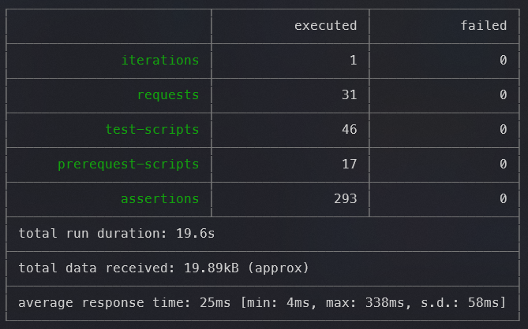
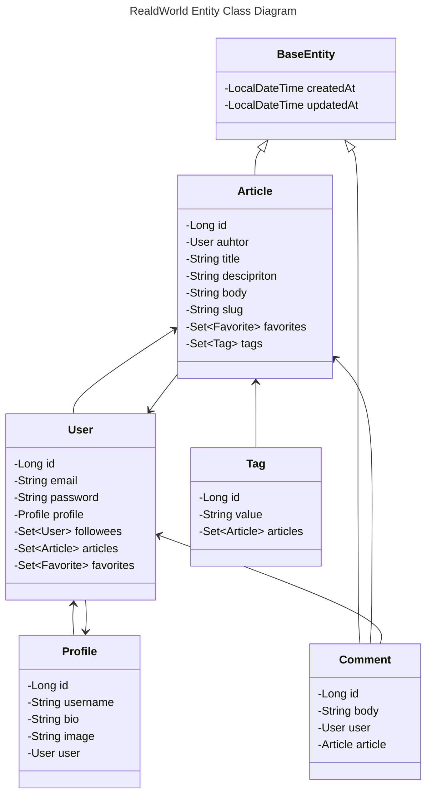
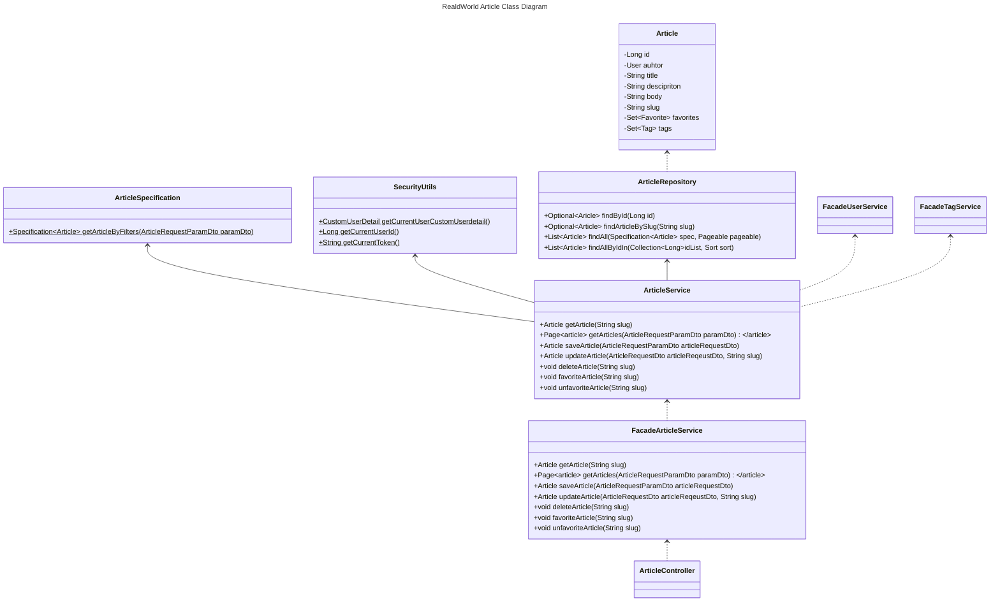
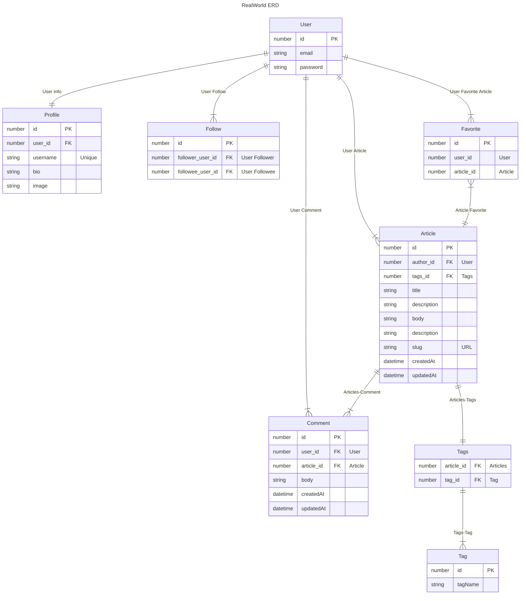

- [환경](#환경)
  - [사용한 기술 스택](#사용한-기술-스택)
  - [프로젝트 실행](#프로젝트-실행)
  - [H2 DB 접속](#h2-db-접속)
  - [테스트 실행](#테스트-실행)
  - [테스트 실행 결과](#테스트-실행-결과)
- [개요](#개요)
  - [Class Diagram](#class-diagram)
  - [ERD](#erd)
  - [트러블슈팅](#트러블슈팅)
    - [1. Article 목록의 동적 쿼리 적용](#1-article-목록의-동적-쿼리-적용)
    - [2. FetchJoin과 Pagination 사용 간 메모리 누수](#2-fetchjoin과-pagination-사용-간-메모리-누수)

---

## 환경
### 사용한 기술 스택
- JDK 17.0.9
- Spring Boot 3.3.3
- Spring Security
- Spring Data JPA
- Lombok
- H2 Database

### 프로젝트 실행

```bash
.\gradlew build bootRun
```

### H2 DB 접속

- [H2 Database](http://localhost:8080/h2-console)

```
JDBC URL : jdbc:h2:mem:test
ID : sa
PWD : 123
```

### 테스트 실행

```bash
./docs/run-api-test.ps1
./docs/run-api-test.sh
```

### 테스트 실행 결과



---

## 개요

### Class Diagram




### ERD



### 트러블슈팅

#### 1. Article 목록의 동적 쿼리 적용

- 동적 쿼리 적용을 위해서는 크게 3가지 방법을 사용 가능
  1. JPQL 사용
  2. QueryDSL 사용
  3. Criteria API 사용
- 이 중에서 제한시간내 구현 및 테스트 가능한 것이 Criteria API로 판단

> 기본적으로 제공되는 Criteria API를 사용해서 프로젝트 환경 설정 시간을 단축

#### 2. FetchJoin과 Pagination 사용 간 메모리 누수

> Fetch Join과 Pagaination을 같이 사용할 경우 다음과 같은 오류 문구 발생
> **HHH90003004: firstResult/maxResults specified with collection fetch; applying in memory**

- 메모리 누수를 방지하기 위해서는 BatchSize나 쿼리 분리 등의 방법이 존재
- 현 프로젝트에서는 쿼리 분리 작업으로 문제 해결
- 게시글 목록 조회 간 Pagination Query와, Entity Join Query가 별도로 나가도록 설정
    1. ArticleService에서 생성된 Specification을 @EntityGraph가 적용되지 않은 JPA Method로 실행
    2. 리턴되는 `Page<Article>` 객체에서 Article Id만 추출
    3. @EntityGraph가 적용되는 JPA Method로 Article Id List를 실행
    4. 리턴되는 값을 `Page<Article>`에 담아 리턴